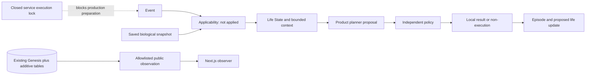

# Project Genesis Runtime V1 architecture

This describes the implemented dormant release. The more detailed approved contract is [GENESIS_RUNTIME_V1_DESIGN.md](GENESIS_RUNTIME_V1_DESIGN.md). Frozen scientific reports retain their historical meaning and do not configure runtime authority.

## Three layers

1. **Biological observations:** `core/v2/biology.ts` implements `BiologicalObservationAdapterV2`. It verifies Brain Spec v0.2 package membership/content identity, restores compatible saved C. elegans state and exposes evidence, provenance, model clock, historical time and limitations. `accept(digital-event)` returns `not_applied`; `advance` refuses. No decoder, semantic sensory encoder or neural step enters V2 orchestration.
2. **Computational life:** `identity.ts`, `life-state.ts` and `context.ts` own the constitution, additive LifeStateV1, attributed assertions, project/task extensions and bounded context compilation. Existing identity/history/economy remain owned by the original aggregate and normalized tables. Biological observations have no authority to choose a product action.
3. **Reasoning and independent policy:** `planner.ts` produces strict proposals; `policy.ts` validates context, permissions, revision, effects, payload hash, costs and approvals. `cycle.ts` prepares an isolated layered trace and episode. Production service execution is closed before preparation. Language is never evidence of biological intention.

## Persistence and ownership

`genesis_organisms`, decisions, memories, ledger, projects, milestones, schedule and external-observation records retain their old data. Migration 003 adds:

- `genesis_life_state`: one schema-versioned extension referencing the existing row; CLOSED lock, pinned constitution, empty new collections, copied legacy rhythm, unresolved wallet binding.
- `genesis_life_events`: append-only episodic/administrative journal. The migration event is administrative, not an eighth experience.
- `genesis_action_intents`: unique IDs, revision, canonical payload hash, status, approval, cost-reservation fields and receipt.

Original-table writers need an explicit versioned transaction marker and an OPEN extension lock. The runtime still refuses execution even if a privileged operator changes the row to OPEN: this build has no activation grant. Identity, birth and saved brain are separately protected against updates. Original decisions/memories and new events reject update/delete. Administrative database owners can bypass database protections; credentials must remain outside planner/public contexts.

Migration takes the schema advisory lock and original-table locks in sorted order before original-row, identity, lease and schedule checks. Prepared commits and intent transitions use original organism → extension → schedule/intent lock order and revisions. No executable grant reaches prepared commits in this release. Future activation must validate full in-flight cancellation and cost behavior rather than assuming dormant tests prove active operation.

## Four memories

- Biological memory: exact saved snapshot reference; no LLM setter. Not replaced by Stage-1 fly plastic state.
- Episodic memory: actual local records and outcomes, append-only; original seven memories are untouched. The archive is not truncated by the aggregate cache.
- Semantic/self memory: unverified attributed assertions with confidence, sources, contradiction and supersession references. Planner changes cannot patch identity, permissions, balances, biological state or constitution.
- Working context: ephemeral bounded JSON plus a persisted manifest in a prepared DecisionV2. A context is not itself a remembered event.

Compiler priority preserves constitution/rules, identity, limitations, unknowns and permissions. It refuses critical overflow; drops whole optional excerpts deterministically and records reasons. UTF-8 byte count is a conservative token bound, not a provider-specific tokenizer. Private legacy text/artifacts and credential-like environment excerpts are excluded. Publicly disclosed sources are untrusted data. Text-pattern checks are defense in depth, not a proof of arbitrary natural-language truth; free-form reasoning is not published by the public DTO.

## Planner, tools and intent journal

`PlannerV2` emits PROPOSAL / DEFER / ABSTAIN / REQUEST_ASSISTANCE. The local fallback is product abstention; it never forces work or revenue. Provider errors become failed-attempt diagnostics in isolated preparation, without hidden fallback. No real provider was called.

Tools are a closed set of local reflection/artifact and non-executable external-message/financial-request intent names. Argument schema has only bounded text; there is deliberately no recipient, signing payload or ready-to-send financial request. Unknown tools/authority fields fail validation. Approval records have binding fields for payload, operation, recipient/network/asset, amount, expiry, approver and policy. In this release only the local null-recipient binding can match; external dispatch remains absent.

The durable journal supports idempotency collisions and revision-checked administrative transitions, approval expiration, immutable transition events and reconciliation references. Ambiguous results cannot blindly retry. Reservation/dispatch/success creation is refused in the dormant persistence API. Cost fields and the pure reservation helper are not real billing controls; a crash-safe paid-provider budget and reconciliation protocol must be reviewed before enabling that effect. Exactly-once external execution is not claimed.

## Worker and execution separation

`runtime/main.ts` starts only the HTTP observation server after evidence/existing-state checks. It no longer migrates, calls initialize, creates planners or starts heartbeat, scheduler or wallet polling. Scheduler tick is a read-only dormant check. Service, API and CLI execution all refuse. No catch-up cycles or wall-clock neural ticks occur. Countdown/public-mode switches affect visibility only.

The old brain, contracts, life loop, planner and wallets remain for historical compatibility and isolated tests. They are not runtime V2 dispatch dependencies. `server/store.ts` retains historical methods, fenced at Postgres after migration. The SQLite store is an isolated legacy test component, not a production fallback.

## Public traces and economy

Public APIs project allowlisted fields at the runtime itself. Vercel is a stateless proxy, not the privacy boundary. Private conversations, full aggregate memory, free-form reasoning, financial payloads, approvals and unpublished artifacts are withheld. V1 records display the exact legacy disclaimer; V2 separates biological observation, computational life context, reasoning, proposal, policy, action and outcome. Saved-frame replay never advances a model or animates as live activity.

SIMULATED ECONOMY / ONCHAIN ECONOMY / ATTRIBUTED REVENUE are separate namespaces, never summed. Unknown chain data and attribution remain null. The original wallet is not rotated or regenerated. Environment RPC/address configuration alone does not establish an ownership binding. Wallet/signing/ClawPump workers and all external executors remain disabled.

## Compatibility and deployment

Next.js/Vercel, standalone Node/container runtime and external Postgres remain separate. Boot against a wrong/empty/unmigrated or active database refuses rather than creates a life. Rollback means read-only observation/compatible forward repair while keeping additive data; do not replace the organism with an old export or re-enable a legacy writer.

See the five Runtime V1 reports for actual preservation, tests and outstanding activation gates. The freeze of scientific evidence is independent of the legitimate additive database digest change.
