# Project Genesis architecture

## Smallest change from the proven core

Keep the real connectome, `CElegansBrain`, its deterministic tests and snapshot format. Extend identity and permitted abstention around the core. Replace the original web-hosted SQLite persistence with Postgres and move orchestration into an independent Node process. Keep the observation UI as a stateless Next.js client/proxy. Add deployable boundaries before integrating live assets.

```mermaid
flowchart LR
  World[Saved next world event] --> Encoder[Sensory encoder]
  Encoder --> Brain[BrainAdapter / Brain v1]
  Brain --> Drive[Neural behavioral readout]
  Drive --> Planner[Constrained planner]
  Planner --> Guard[Policy guard]
  Guard --> Tools[Selected tools or idle]
  Tools --> Outcome[Outcome and experience]
  Outcome --> DB[(Postgres)]
  DB --> World
  Scheduler[Independent container scheduler] --> World
  DB --> API[Runtime observation API]
  API --> Web[Next.js / Vercel]
```

## Boundaries

- **`core/brain/celegans.ts` + `data/`:** biological source identities, encoding mappings, dynamics and readout pools. Unchanged by the portability/life extension.
- **`core/contracts.ts`:** generic `BrainAdapter.initialize / stimulate / step / decodeBehavior / getState / snapshot`, nodes, edges, channels and opaque versioned snapshot. No storage or hosting provider imports.
- **`core/life.ts`:** event → encoder → 80 integration steps → decoder → planner → guard → action → outcome → experience → next event. Errors are recorded. Tool mutations are staged until success.
- **`core/planner.ts`:** deterministic local adapter and real server-side OpenAI adapter. Behavior enum contains exactly the neural output. Execution validation independently rejects mismatches. `idle` is legal abstention under every impulse; it cannot rename the impulse.
- **`core/identity.ts`:** durable birth and one-time milestones. Identity, brain lineage, memories, wallet and projects survive `replaceBrain`; the new species supplies a compatible initial snapshot. A deployment replacing the brain must migrate its snapshot intentionally, never auto-reset an incompatible brain.
- **`core/wallet.ts`:** simulated integer-cent economy and idempotent entries. **`core/economy/adapters.ts`:** separate chain/asset-specific balance and income readers, finalized receipts and approval intents. No live executor is wired in.
- **`server/store.ts`:** Postgres repository, transactional state/trace commits and cycle leases.
- **`runtime/`:** portable composition root, HTTP API, configuration, versioned migrations and persistent scheduler. Railway supplies a process, environment and network; it is not imported by application code.
- **`app/` + `server/runtime.ts`:** Next.js views and stateless HTTP proxy. No database, brain or scheduler imports. `components/brain-view.tsx` receives nodes/edges from the brain API and activation from saved traces.

## Persistent life

`genesis_organisms` retains the authoritative aggregate, revision, pause state and cycle lease. `genesis_decisions` is an append-only record of the causal chain including complete before/after neural snapshots and sampled frames. Separate tables hold memories, ledger entries, projects and milestones. Working recall is bounded while decisions retain experience history. Aggregate and normalized records commit together. Birth uses the original identity timestamp; importing an existing life does not fabricate a new birth.

`genesis_schedule` stores enabled state, nullable remaining cycles, due time, heartbeat and last error. A container timer merely wakes the repository; it is not the source of truth. Startup respects persisted controls. A new database starts with scheduling disabled even when `GENESIS_AUTONOMY_ENABLED=true`; the operator explicitly starts its life loop. The environment switch permits scheduling, while database state controls whether it is running.

The worker uses a 60-second database lease, row locks, revisions and a UTC daily committed-cycle quota. Concurrent/manual/scheduled requests share the same claim path. A commit requires the current valid lease and revision; stale workers cannot overwrite state. Pause during an in-flight cycle is preserved. State and full decision commit atomically. Failed outcomes stop the automatic schedule. An expired claim can be retried; no neural or economic mutation becomes authoritative before commit. Heartbeats and health checks expose process/database availability.

A small **product-level** energy budget encourages periods of recovery: active actions spend 0.13, restorative actions recover 0.20, rest latches at ≤0.20 and clears at ≥0.80. The local planner chooses idle during recovery; the real planner receives the same context and can choose an allowed restorative action. Rest and idle double the next interval. Neither the energy values nor wall-clock scheduling claim worm physiology. Neural state advances only during actual simulation cycles; website animation does not advance it.

## Trust and side effects

Public reads expose the experiment. Operator mutations require a long bearer token and an allowed origin for browser requests. Vercel forwards a supplied operator token; it does not inject a privileged production secret. Database credentials and LLM keys exist only in the runtime. Research uses fixed read-only source URLs, bounded responses and timeouts; fetched text is untrusted planner input.

Pending approvals cannot execute money transfers, investments, publication, human hiring or physical actions. Real Solana reads and ClawPump receipts are separated from the development currency. Adding execution requires approval verification plus an outbox and provider-level idempotency/reconciliation. A process crash can repeat a paid LLM request before its decision commits; current cycle limits are not exact provider cost accounting.

## Verification and evolution

The original connectome checksums, ablation and replay tests remain. Added tests cover birth preservation, brain replacement, idle constraints, configuration, asset isolation and real Postgres lifecycle/scheduler behavior. The deterministic proof remains independent of the web/runtime/database.

Postgres row-level serialization permits overlapping restarts, but one runtime replica is the simplest initial deployment. A larger organism can replace Brain v1 behind the same contract. Longer experiments will need compressed trace archival and smaller aggregate state; this MVP deliberately retains detailed inspectability over optimizing multi-year storage.
