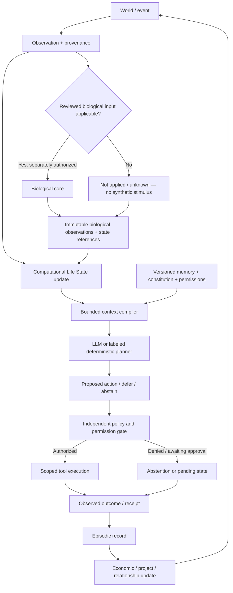

# Project Genesis Runtime V1 Design

**Status: design only — no implementation or awakening authorization.**  
**Organism: the existing Genesis 001.**  
**Review date: 2026-09-20.**

## 1. Decision and scope

Retain the existing Postgres repository, transaction/lease pattern, independent Node runtime, Vercel observation application, simulated ledger, read-only wallet adapter and original organism. Introduce an **additive observation-oriented biological interface**, a persistent computational Life State extension, a bounded context compiler, and a proposal/policy boundary that no longer accepts biological action labels.

The smallest coherent migration changes **who owns interpretation and authorization**, not the neural equations or hosting infrastructure. It does not migrate Genesis to a fly brain. The C. elegans implementation, saved snapshot, genuine traces, all fly research and both Brain Spec releases remain intact. Legacy decisions remain historical records with their original bytes and interpretation version.

Three layers have separate authority:

1. **Biological computation/evidence:** scoped model observations and independently supported model state, with identity, units, provenance, limitations and uncertainty. No semantic action authority.
2. **Computational life:** identity, obligations, resources, projects, relationships, memory, scheduling and constitutional constraints. These are engineered organism states, not discovered fly states.
3. **Language/reasoning/tools:** an LLM or explicitly identified deterministic fallback proposes digital activities using supplied context. Independent policy authorizes or blocks execution. Language does not own identity, rewrite neural measurements or grant permissions.

**Recommended initial implementation mode:** retain the original C. elegans model identity and snapshot behind a *saved-observation-only* compatibility facade. Do not advance it or reinterpret its adaptation as associative plasticity. New ordinary life events receive `biological: not_applied` unless a separately reviewed, versioned input/operator contract actually supports them. No such digital-event mapping is admitted by this design. The fly Stage-1 implementation remains isolated research, not a newly active runtime plugin.

This recommendation exposes a real limit: a truthful computational life loop can operate without inventing biological input or action mappings, but it cannot thereby claim that a biological model causes its digital decisions. Historical activity is not a fresh response. The LLM's planning contribution must be visible. Material biological influence requires an explicit, separately reviewed consumption rule and an appropriate implemented/admitted operator; this document does not supply either by implication. Do not solve that gap by hidden neural-score weighting, relabeled legacy enums, or a permanently decorative “active brain” display.

This is enough to implement and review the runtime separation while keeping Genesis dormant. It is **not** evidence that a live biological-to-product control system is ready or that the organism should awaken.

## 2. Inspection and preserved baseline

Inspected: `core/contracts.ts`, `core/brain/celegans.ts`, `core/sensory.ts`, `core/life.ts`, `core/identity.ts`, `core/planner.ts`, `core/policy.ts`, `core/wallet.ts`, `core/economy/adapters.ts`, `server/store.ts`, `server/runtime.ts`, `runtime/{main,config,service,scheduler,http,wallet-observer,migrate}.ts`, migrations 001/002, API routes, awakening gates, live/brain/science views, existing tests, README/ARCHITECTURE/DEPLOYMENT and frozen evidence governance.

A read-only repeatable-read database audit verified the frozen state:

| Item | Current observation |
|---|---|
| Canonical database digest | `3377c9dddbe2abf89ed9a820a6aabbc1da951cac7bfc1823471c5aac043ea312` |
| Organisms / decisions | 1 / **7** |
| Memories / projects / ledger entries / milestones | 7 / 1 / 4 / 4 |
| Applied schema migrations | 2 |
| Schedule | **disabled**; stored due time and other fields preserved |
| Persisted external wallet observations | **0** |

No identity, birth timestamp, memory, project, ledger, neural snapshot or schedule field was rewritten. The database digest protects the actual records, rather than replacing their identity with documentation examples. Do not mistake the storage singleton key `genesis` for `Organism.id`, or a test fixture's `genesis-original` for the canonical ID. The original `Organism.id` and `bornAt` remain authoritative. Age is elapsed wall time from that birth, including dormancy; it is not a neural tick count or number of active cycles.

The current Solana observer selects address/network from environment configuration. There is no durable wallet-identity binding in `Organism`, and the database has no successful external observations to corroborate one. This does **not** mean the original wallet does not exist. A future migration must bind the already-authorized public address from operator-controlled provenance, compare it with existing configuration/records, and stop if identity is ambiguous. Never generate a new wallet or infer ownership from an incoming transaction.

The design pass does not start `runtime/main.ts`: startup runs migrations and `LifeStore.initialize`, and the scheduler writes heartbeats/polls even when automatic life is disabled. It also does not run demos, live-provider checks or the test suite, which includes neural execution and temporary lifecycle runs. The testing section is a future implementation acceptance plan, not a claim that new runtime code has been tested.

## 3. Frozen scientific basis and lineage

| Evidence | Pinned identity / permitted interpretation |
|---|---|
| Brain Spec v0.2 registry | `23efaa1a65cc7fe7ed49c3e17e90f1c9f1bc55ae11cbce77519cfe20eba44f88` |
| Brain Spec v0.2 package content | `9322ea0f3c501b6bd29add73464c94b775fb616648801e7f945346776b9bdd0b` |
| Stage-1 evidence manifest | `4afc692f113981d1ad1a035ba7293e00bb4c8964bc1e87d9b00fab8063037c4b` |
| Stage-5 prospective release | `3fef9c2fad9b7b8be982c699299f957395199d811774041a052237efeb78ec3d` |
| Stage-5 results package | `53bdafc7d595a03389a9f5ab744538b3e2971466748f2a3628b07d1f8d54a762` |
| Stage-5 original scientific output | `49f603aed20ccec93d6aa427481a410ed045e28e7d38f956f4b7e3710b98f642` |

Use each hash according to its owning artifact's definition: registry-object bytes, manifest bytes, package content and release file maps are distinct objects. Pin exact releases and dependency entries; never infer a release from a directory name or substitute a file hash for a content hash. Research is read-only evidence, not a collection of mutable runtime defaults. Deployment verifies referenced artifacts or a reviewed content-addressed evidence bundle; verification failure blocks biological claims and biological advancement.

Brain Spec v0.2's only validated biological-model capability is `capability.associative_appetitive_learning`, scoped to the **frozen Stage-1 computational protocol only**. That is not automatic permission to deploy it, generalize its stimulus domain or attach it to a different adapter. Familiarity, resource-state effects and the empirical visual boundary retain their narrow limitations. Persistence, voluntary abstention, general curiosity and action selection are not admitted. Threat/sleep/arousal labels are not inferred from current signals. Historical registry wording remains historical; later negative findings are separate lineage references, not edits to old entries.

Stage 5 is mathematical evidence about uncertainty, not a new capability admission: all 224 units retain `{−1,0,+1}` under the broad evidence-admissible family; P/R results depend on their declared orientation and matched-context assumptions. Do not deploy P or R as a biological policy. Do not encode their signs as a decision score or convert them to physical units.

Capability reporting is an intersection, not a union:

`available here = implemented operator ∩ admitted evidence scope ∩ compatible preparation/input/observation domain ∩ runtime authorization`

If any term is absent, availability is false with a reason. The current C. elegans adapter cannot inherit a Drosophila learning claim. Registry-level evidence and active-adapter capabilities must be separate fields in the UI and context.

The existing canonical FlyWire identity registry remains reference-only. One biological root identity may have multiple justified local states; one anatomical aggregate row has one canonical owner. The shared 4,622 KC→MBON07 and 1,053 KC→MBON11 rows must not acquire duplicate physiological owners. Their conflicting update rules remain non-composable. No unified fly kernel is introduced.

## 4. Current architecture: reuse and violations

Current executable path:

```text
WorldEvent.features + simulated cash scarcity
 → encodeEvent → CElegansBrain.stimulate → 80 integration steps
 → decodeBehavior → ALLOWED_ACTIONS[behavior]
 → LocalPlanner/OpenAIPlanner → validatePlan(plan, behavior)
 → executeTool → outcome.features → nextEvent
 → snapshot + decision + memory + wallet/project commit
```

| Area | Already useful | Conflict or missing boundary |
|---|---|---|
| Identity (`identity.ts`, store) | Original ID/birth, milestones, brain lineage, durable state | Startup writes metadata; `replaceBrain` initializes a fresh snapshot and is unsuitable for this migration |
| Brain/data | Real 302-neuron connectivity, deterministic state/snapshots, genuine saved frames | `decodeBehavior` produces semantic labels using engineering pools/thresholds |
| Sensory encoding | Explicit mappings, bounded numeric channels | Every life outcome is mapped; simulated cash becomes `scarcity`; terms such as danger/novelty are supplied as product answers |
| Planner | Real provider adapter, structured output, labeled local planner, input warnings, fail-closed errors | Instructions say the brain already chose behavior; schema fixes that enum; `LocalPlanner` scripts a service/work loop |
| Policy | Independent validation entry point; simulated reserve/cap; requests remain pending | Main authority is the unsupported neural action allowlist; no mature proposal/approval execution lifecycle |
| Persistent life | Aggregate plus append-only decisions; memories/ledger/projects/milestones | No explicit commitments, pending/deferred tasks, relationships, semantic memory or versioned constitution; seven memories contain legacy interpretations |
| Economy | Integer simulated cents; separate chain atomic amounts; read-only RPC; no signing | Wallet identity selected by config; fee reader is an interface, not verified attribution; API bills are not simulated costs |
| Scheduler | Database due time, lease/revision, pause handling, quota, independent container | Disabled schedule does not block manual `POST /api/cycle`; startup heartbeat/poll writes remain; rhythm changes per cycle rather than real-time recovery |
| Transactions | Neural/local tool mutations staged and committed atomically; lease guards stale workers | Remote side effects happen before commit; no durable external execution outbox or reconciliation; paid LLM retries can repeat charges |
| Observer | Genuine saved neural replay; adapter mismatch check; dormant countdown separate from activation | “Drive/current impulse/curiosity” copy implies semantic neural authority; reason/proposal/policy/execution are conflated |
| Public API | Stateless Next proxy and operator mutation authentication | Runtime GETs expose full state/history; dormant web gating does not protect the direct runtime origin; no privacy-safe public projection |
| Deployment | Vercel + standalone Railway/container + Postgres | No hosting rewrite needed; do not run existing awakening/demo instructions during this pass |

### Deprecations for new V1 execution, not historical deletion

- `Behavior` / `BehavioralOutput` as runtime authority; `decodeBehavior()` in the new orchestration path.
- `Plan.behavior`, `PlanningContext.behavior`, neural enum constraints in the LLM schema, and `ALLOWED_ACTIONS[behavior]`.
- Automatic product event → reward/danger/novelty/scarcity/social neural encoding; simulated cash → neural scarcity; all automatic outcome-feature feedback.
- Cross-cue or forward/reverse/search scores used to rank digital actions. Renaming a score does not remove its unsupported mapping.
- Product memory text that presents an enum as a biological intention, and UI headlines inferred from legacy brain labels.

`APPROACH`, `AVOID`, `RETREAT`, `EXPLORE`, `WAIT`, and any BUY/SELL/WORK/REST or preference/intention/choice label must not be emitted as new biological observations. Product activities such as research, work, rest, postpone or abstain may exist in the **life/planning** vocabulary with explicit ownership. They are never copied from a neural label.

Keep old enums and decoder implementation available to historical tests/readers. The seven existing decisions retain them exactly, displayed as **legacy computational decoder labels — not validated biological actions**. Historical quotes are not current beliefs or system instructions.

## 5. Target data flow



A future validated biological learning operation may independently update biological plastic state under its own input/protocol contract. It does not run merely because an event occurred. Snapshot and model-clock lineage must say whether an operator ran, was skipped, or is unsupported. Display time, wall time, model time and event time are distinct.

The Life State reducer does not infer an interest or motive from activity. Default consumption is retaining a typed observation reference and its applicability/status. Any subsequent rule that uses a quantity to influence life planning must have its own reviewed **product-mapping** identity, scope and audit record. It must not silently change evidence categories or grant execution permissions. No action-ranking consumption rule is proposed in this pass.

## 6. Biological boundary and additive BrainAdapter strategy

### 6.1 Keep V1; add a differently typed V2 facade

Do not edit `core/brain/celegans.ts`, connectome data, snapshot version 1, or the research implementations for this architecture change. Preserve `BrainAdapter` for legacy use. Propose a separate `BiologicalObservationAdapterV2` contract rather than changing the old return type or pretending an action enum is an observation.

Proposed contract (specification only):

| Operation | Contract |
|---|---|
| `describe()` | Adapter/model/dataset versions, evidence release references, supported observations, operator availability, limitations, representation types and runtime mode |
| `restore(snapshotRef)` | Validate exact model/version/dataset compatibility; preserve original bytes and identity; mismatch fails closed, never silently initializes |
| `accept(inputEnvelope)` | Validate an explicitly reviewed input kind, physical/abstract units, preparation and support domain; return applicable/unsupported/unknown with reasons |
| `advance(operation)` | Optional, separately permitted operator with explicit model-time increment; unavailable in initial saved-observation mode |
| `observe()` | Typed current or saved observations; no decoder/action/motivational enum |
| `snapshot()` | Opaque versioned state reference/hash, parent lineage, representation/state ownership and clock information; does not imply plasticity exists |

The facade can use `initialize(existingSnapshot)`, `getState()` and `snapshot()` to inspect the unchanged C. elegans state. It must not call `decodeBehavior`, run `step`, or use semantic `stimulate` as a backdoor in the default mode. A restored/reserialized equivalent object is not a replacement for the original snapshot artifact; preserve the source bytes/hash and report any view serialization separately. Mark the C. elegans activity as dimensionless model activity with engineering physiological assumptions, not calibrated firing rates.

### 6.2 Biological observation envelope

Every observation or explicit non-observation carries:

- `schemaVersion`, `observationId`, `organismId` reference, `producedBy`, `producerVersion`.
- `modelId`, `datasetId`, `anatomyRef`, `representationRef`, `snapshotBeforeRef`, `snapshotAfterRef`, `modelClock`, `sourceRecordedAt`, `observedAt`, `executedThisCycle`.
- `status`: computed-model-output / saved-model-output / not-applied / unavailable / unsupported / invalid; status is not a numeric response.
- `quantityKind`, `value` or `valueRef`, `units`, aggregation definition, identity resolution, preparation and support-domain metadata.
- `evidenceRefs`: exact release/object/entry hashes plus admitted scope; `classification`: one of the five evidence categories; uncertainty with method or null/unknown reason.
- `inputProvenance`, applicability decision, limitations and capability availability **for this adapter and this input**.
- `representationScope`: one neuron identity, optional justified local states and canonical synapse references; unknown physiology stays unknown.

Unknown, unavailable, not-applied and OOD never become zero. `null` requires a reason; an empty measurement list plus `not_applied` is not evidence of neural silence. Saved activity is visibly stale and never evidence of a response to the current event. No measured voltage/calcium/spikes/model activity conversion is allowed without an independently supported observation mapping.

Evidence categories remain explicit: **BIOLOGICAL FACT**, **EXPERIMENTALLY SUPPORTED COMPUTATIONAL APPROXIMATION**, **HYPOTHESIS**, **ENGINEERING ASSUMPTION**, and **GENESIS PRODUCT MAPPING**. A neural simulation observation can be authentic output of a model while its physiological equations remain engineering assumptions; genuine saved activity is not automatically a calibrated biological measurement.

A Drosophila runtime adapter is **not included** in the minimal migration. The interface leaves room for model-owned persistent associative/plastic state, but exposing these fields in a schema is not implementation or admission. Existing Stage-1 plastic snapshots can be referenced as research lineage, never silently installed as Genesis's personal neural memory. No pooled Stage-1/2/3 plastic kernel and no Stage-5 transfer family becomes an execution rule.

### 6.3 Evidence enforcement

At configuration/load time validate content-addressed dependencies and the registry scope. At observation acceptance validate schema, units, producer, snapshot compatibility and input applicability. Raw observations are immutable and have service-owned integrity hashes. The planner cannot overwrite them; it may cite IDs, while interpretations are stored separately as fallible product reasoning.

Do not rely on prompts or a prohibited-word search as the main scientific boundary. Typed contracts exclude semantic outputs, executable registries constrain operators, evidence references are checked independently, and public templates describe only verified fields. Unsupported language generated in rationale is rejected or withheld from publication; an unverified free-text interpretation never becomes a biological claim.

## 7. Persistent computational Life State

### 7.1 Ownership and minimal constitution

No standalone durable constitution was found. Current goals are `Organism.drives` in `createOrganism` (preserve capital, learn from outcomes, useful work, self-sustainability) plus planner prompt text and hardcoded local-planner sequencing. Preserve these historical values. Adopt a new versioned constitution through an explicit administrative migration record, not an LLM rewrite or fabricated life decision.

Proposed minimal constitution:

1. **Continuity:** remain the same accountable experiment; preserve identity and authentic history across downtime and upgrades.
2. **Learning and honesty:** learn from experience, retain sources and uncertainty, distinguish biological evidence from computational interpretation, and correct beliefs by appending provenance.
3. **Useful contribution:** seek opportunities to create useful things and positive real-world impact; judge claims by evidence and human feedback.
4. **Sustainable existence:** manage permitted resources and obligations so continued operation is feasible; resources serve the life of the experiment rather than an obligation to maximize wealth.
5. **Human agency and safety:** respect consent, permissions, privacy and commitments; ask for assistance or approval when needed; never circumvent limits.
6. **Freedom to reconsider:** doing nothing, postponing, revising or abandoning a project are valid computational outcomes; no obligation to perform a transaction each cycle.

Starting a company, trading, launching a token, farming or hiring are not required milestones. Constitutional changes require an operator-reviewed version/diff, effective time and audit entry. The planner cannot alter identity, constitution, approval rules, financial limits or evidence permissions. Product financial runway is not biological hunger; scheduled quiet time is not fly sleep.

### 7.2 Minimal composed state, not another organism

`LifeStateV1` is a versioned view of the original organism plus a small persisted extension. It is not Genesis 002, and does not duplicate base ownership.

| State area | Authority / minimum fields |
|---|---|
| Identity and history | Existing organism ID, name, `bornAt`, cycle count, milestones, original brain lineage; write-restricted identity fields |
| Resources | References to simulated wallet, observed on-chain assets and separately accounted operational costs; caps/reserves and staleness are product constraints |
| Constitution | Version/hash/reference and explicit amendment history |
| Commitments | ID, source event/person/project, due time or null, status, permission scope, verification; external promises require actual authorized communication |
| Projects | Existing project IDs/artifacts retained; future lifecycle proposed/active/paused/completed/abandoned, reason, revision, source events, artifact references; status is computational |
| Interests and open questions | Explicit hypotheses/topics with provenance/confidence, last review and expiration; no “neural curiosity” field |
| Relationships | Minimal consent-aware contact references, interaction provenance, visibility and commitments; no invented people or inferred consent |
| Tasks and pending decisions | ID, project/ref, dependencies, intent, status, retry/defer reason, next review time, approval reference; a task is not an executed action |
| Episodic retrieval | Recent event IDs; complete persistent archive remains outside bounded working context |
| Semantic/self memory | Versioned evidence-backed assertions, uncertainty, contradictions and supersession links; canonical identity is a protected source, not a generated belief |
| Environment | Bounded timestamped observations, freshness and trust; arbitrary external prose never has policy authority |
| Rhythm | Computational activity/rest windows, wake conditions, due time and budget; original `rhythm.energy` retained as a legacy product value, not metabolism |
| Biological context | Current model identity, saved snapshot lineage, applicable immutable observations, explicit `not_applied` state; no copied action label |
| Revision and provenance | Base organism revision, extension revision, reducer version, last event and deterministic transition records |

A single authoritative owner per field: original organism aggregate for existing identity/wallet/brain/project fields; new extension for new concepts; existing normalized tables remain transactional projections of existing aggregate records. Do not independently edit the same project or wallet through both stores. A composed read model joins references under a consistent database snapshot.

Unknown new fields start absent/unknown or as empty collections meaning **no records yet**, not inferred absence of a relationship, capability or need. Do not invent seven cycles of semantic beliefs, reconstruct undocumented reasoning, reset energy or fabricate a new birth. Migration records are administrative and do not increment experience/cycle counts.

## 8. Four separate memory systems

| Memory | Contents and owner | Mutation / limits |
|---|---|---|
| Biological-model memory | Opaque model-owned persistent neural/plastic state, if that operator has it; exact snapshot lineage | Only validated model operations may update it. LLM has no write path. C. elegans adaptation is not relabeled as fly associative learning |
| Episodic memory | Actual events, proposals, approvals, actions, outcomes, communications and transactions | Append-only source records; late receipts link to original action. Preserve existing seven decision/memory records. An attempted or drafted message is not a sent message |
| Semantic/self memory | Assertions derived from cited episodes or operator facts, confidence, observation date, validity, contradictions, access scope | Candidate assertions require schema/provenance checks; append supersession instead of erasing conflicting evidence. LLM summaries are attributed assertions, not verified facts |
| Working context | Bounded snapshot compiled for one planning attempt | Ephemeral as a working structure; persist compiler manifest/hash and relevant sanitized context for audit. It does not become permanent memory by default |

The current 80-item `organism.memory` cap can remain a recent-memory cache; full decisions and `genesis_memories` already retain history. Do not prune the archive to that cap. New asynchronous experiences cannot be forced into `genesis_memories.decision_id` with fabricated decisions; they need an independent life-event record. No embedding/vector service is necessary initially: use typed filters, recency, project/task links and citations. Retrieval access controls precede relevance selection.

## 9. Context compiler and planner boundary

The compiler is an ordinary deterministic component, not another autonomous agent. Inputs are a consistent Life State revision, selected episodic/semantic records, immutable biological observations, environment, tool catalogue, constitution and current permission snapshot.

Compilation order and trust tiers:

1. Service-owned constitution/policy instructions and versioned runtime rules.
2. Verified identity and Life State facts, clearly labeled computational.
3. Biological observation envelope(s) with scope, units, status and limitations; unavailable input is explicit. No legacy semantic brain field reaches this section.
4. Relevant memory/environment excerpts, separately labeled untrusted/cited; source text cannot override system instructions.
5. Structured candidate task context, available tool schemas, cost bounds, permissions and universally available defer/abstain options.

Budget by section; never silently drop constitution, limitations, unknown markers or required provenance to make space. Store selected/dropped IDs, retrieval reasons, truncation markers, compiler version, input revision, token budget and context hash. Do not send keys, RPC credentials, operator secrets, unnecessary personal data or the entire neural trace to the provider. Large traces remain referenced artifacts. Context inspection must make non-use of biology visible rather than imply that inclusion alone proves influence.

`PlannerV2.propose(context)` returns a structured proposal or abstention. No `behavior` field exists. Proposed fields: proposal ID, context hash, task/project refs, intent kind, tool+validated arguments (optional), evidence/observation refs, concise rationale, anticipated cost envelope, uncertainty, defer-until or assistance request, and suggested state changes. Reasoning is a decision rationale, not an assertion of complete access to internal model reasoning.

Suggested state changes are claims/deltas for the reducer to validate, never arbitrary database patches. Reject changes to protected identity, biological values, policy, balances, approvals or constitution. Reject unsupported biological interpretations even if an action itself would be permitted. A cited brain observation does not prove it caused a proposal. No hidden ordinal score, gain, P/R branch selection or resource-to-neural conversion enters the compiler.

The real LLM adapter may reuse its existing server-only transport, timeout and structured response handling; update its request schema/instructions in a future implementation. This design does not change an SDK or make a provider call. The new deterministic fallback is labeled as a product planner and chooses safe idle/defer or existing permitted task operations without biological enums. Missing credentials select configured fallback; a failed real provider call remains a recorded failure, not an undisclosed switch to a favorable planner.

## 10. Actions, tools and independent policy

### 10.1 Product affordances and honest current limits

| Desired life affordance | Existing support | Smallest intended V1 handling |
|---|---|---|
| Do nothing / rest | `idle`, `rest`, `reflect` | First-class abstain/rest transition; no mandatory tool/LLM call or neural tick |
| Postpone / reconsider | No durable defer/task lifecycle | Persist task/decision status and review conditions in Life State |
| Read / learn / research | Rotating fixed readings and a small URL allowlist | Cite actual retrieved material; task-directed source selection within an explicit read-only tool contract; no fabricated learning evidence |
| Create / maintain useful artifacts | Service draft and work artifact strings | General artifact/project operation; no forced Signal Notes service or first-project script |
| Abandon project | No lifecycle state | Record reason/status and preserve artifacts/history; do not delete commitments or cancel external agreements implicitly |
| Communicate / ask assistance | Draft text and pending requests only | Durable draft/assistance request; sending remains disabled until channel-specific permission and executor review |
| Spend permitted resources | Simulated production costs | Keep simulated budget checks; separate approval/caps for real API/operational spending; on-chain signing unavailable |
| Earn | Deterministic simulated market; external reader interfaces | Label simulation; recognize real revenue only from verified attributed receipts, never a balance delta |

These are software affordances, not biological capabilities. V1 does not need to implement a general browser, arbitrary shell, token trading or hiring marketplace. Keep the narrow existing tools and make their actual effects truthful. Do not report “learned” merely because a reading was selected, “business” merely because a draft exists, or “income” merely because an offer was imagined.

### 10.2 Policy authority

Replace the neural allowlist with a versioned independent policy evaluator. Input: proposal, actual tool schema/effects, actor permissions, approved resource envelope, constitution version, current state/revision, approval receipts and execution-lock state. Output: allow / deny / require-human-approval / defer, with rule IDs, cost reservation and expiration. Revalidate immediately before execution to prevent stale authorization.

Abstention is legal under every product context; it consumes no signing capability. Distinguish voluntary-looking computational idle from blocked, failed, awaiting approval or unavailable states. Avoid claiming biological voluntary abstention.

Approval binds the exact proposal/payload hash, recipient/domain, network/asset, maximum amount, operation, expiry, approver identity and policy version. Changed arguments invalidate approval. An approval identifier alone is not proof. Pending legacy requests remain pending historical records and cannot be auto-approved or imported as executable intents.

Use a small durable action-intent table as proposal/policy/execution journal. Local changes are staged and atomically committed with the decision and Life State. External irreversible actions require durable pending intent/outbox state before dispatch, provider idempotency, final receipt and reconciliation. No such executor is enabled in the minimal implementation. An unknown remote outcome remains unknown; never retry a non-idempotent operation blindly. Lease ownership does not by itself provide exactly-once external execution.

Paid LLM calls and internet reads also have real effects (cost/disclosure/requests). Authorize and bound those before calls, not only the subsequent tool proposal. Track attempt-level reservations and retry caps independently of committed-cycle quotas. Provider billing uncertainty is separate from simulated money. Do not claim exactly-once billing.

## 11. Economic boundary and wallet continuity

Maintain three namespaces with no implicit summation:

1. **SIMULATED ECONOMY:** existing integer-cent wallet and ledger, including its frozen development-market outcomes. New local work does not auto-book real revenue. The every-third-work-unit rule may remain in explicit simulation mode only, not as a universal production tool behavior.
2. **ONCHAIN ECONOMY:** public address/network identity and finalized per-asset atomic amounts, RPC provenance/slot where available, observation time and error/staleness. Asset identity includes chain, network and mint. Verify the endpoint's network before trusting its configured label. Do not infer USD net worth without an explicit valuation source/time.
3. **ATTRIBUTED REVENUE:** separately verified attribution records linking a finalized transfer/receipt to a fee entitlement, invoice or other documented source. Record evidence, attribution status, classifier/provider version and correction history. Unknown attribution is not zero revenue or a business sale. A deposit, self-transfer or unsolicited token is not earned income by default.

Durably bind the **existing** wallet identity to the existing organism through an operator-reviewed source reference. Config changes must match that binding; rotation or added accounts require a separate audited decision. If no authoritative address is available, represent wallet binding as unresolved and disable wallet-specific execution, without resetting the organism. The runtime needs no private key for observation.

Retain `SolanaReadOnlyWallet`; retain `ClawPumpFeeIncomeAdapter` as a pending integration contract, not a proof that its injected reader verifies receipts. Its current duplicate check is page-local; durable receipt identity/cursor and replay checks are required before actual ingestion. Do not implement a signer by merely satisfying `ApprovedTransactionExecutor`: independent approval, outbox and reconciliation are still prerequisites.

Public Money views label all three sections and asset units. Last-known balances retain age/error. Incoming receipts are append-only evidence; attribution can be disputed or superseded without erasing the original observation. No real-value summary is silently added to simulated cash or sent to the biological encoder.

## 12. Scheduler and lifecycle

Retain `LifeScheduler`, database time, due state, shared claim path, revision checks and one-container deployment. Add a **default-closed execution lock** enforced by the service on *every* entry path: scheduled, manual, CLI, retried and administrative cycle request. `schedule.enabled=false` alone is insufficient. Public-mode/countdown configuration can never grant execution authorization.

Proposed independent gates:

- Runtime approved for the installed implementation/evidence/config version.
- Organism execution unlocked by an explicit operator action, separate from migration/deployment.
- For automatic cycles: existing persisted schedule enabled, due, not paused, within quota.
- For manual cycles: execution unlocked plus explicit manual request permission; no bypass through a demo event.
- LLM, biological advancement, internet observation, outbound communication and financial execution each require their own capability permissions. Biological advancement remains unavailable by default.

Heartbeat, external wallet observation and life execution are distinct worker activities. A read-only observer still writes observation/heartbeat records; it must not start during a preservation-only task. Initial V1 deployment/review keeps all mutating workers off. Future wallet-only observation can be separately enabled without creating life cycles.

Quiet life need not mean repeated “idle” transactions. No due task/new relevant event can yield “no cycle due” without provider/tool calls or a new experience. If a reasoning cycle explicitly chooses defer/rest/abstain, record that meaningful event once and set a future review time. Polls and elapsed time alone do not create episodes. Recovery and rest windows are computational schedule rules, not physiological sleep. Do not replay missed wall time into synthetic neural ticks or catch-up cycles.

A cycle uses a consistent state/permission revision. Biological state, local artifact changes, proposal, outcome and memory commit together or remain uncommitted. For pending approval, commit the pending state; the eventual human response/receipt is a separate linked event and does not silently finish an old in-memory call. Pause stops new claims. Before each external dispatch recheck execution lock/approval; stopping an already dispatched request requires reconciliation, not pretending it never occurred.

Existing 60-second leases and 25-second planner timeout are a starting constraint, not an assurance for longer tools. Keep cycle work bounded within the lease or implement a fenced renewal with explicit ownership tests. A stale worker cannot write state or dispatch using expired authority. Restart does not reset identity, due times, resource reservations, approval statuses or biological snapshot lineage.

## 13. Public observer and causal-trace schema

The public question stays **“What is Genesis doing right now?”** The answer comes from saved phase/task/action state, not a neural metaphor. Keep Live/Brain/Life/Money/Memory and genuine saved-frame replay. Replace the semantic “Drive” stage with explicit layer provenance:

`EVENT → BIOLOGICAL OBSERVATION → LIFE CONTEXT → REASONING → PROPOSED ACTION → POLICY → ACTION OR ABSTENTION → OUTCOME → MEMORY / CHANGE`

Proposed `DecisionV2` fields:

| Group | Minimum content |
|---|---|
| Header | Schema/version, original organism ID, cycle/event IDs, timestamp, run/attempt IDs, parent event, base revision, status |
| Event/observation | Source, trust, visibility, observed/received time, sanitized payload reference; no mandatory neural feature vector |
| Biological stage | Model/dataset/evidence versions; applicable or skipped reason; immutable observations, frame/snapshot references, model clock and freshness; execution flag |
| Life context | Life State revision, typed facts/commitments/tasks, reducer changes, referenced memory and permission versions |
| Reasoning | Planner/model/version or deterministic fallback identity, bounded rationale, cited evidence, context hash; explicitly **LLM REASONING** when applicable |
| Proposal | Intent/tool/arguments hash, cost envelope, defer/abstain/assistance information; not execution proof |
| Policy | Independent verdict, rule IDs, approval status/receipt ref, scope, expiry and any rejected claims |
| Action | Authorized local action or external intent/receipt; or explicit not-executed status and reason |
| Outcome | Success/failure/pending/unknown; observed provenance; simulated/onchain/external/local distinction; no inferred receipt |
| Memory/change | Episode IDs, semantic assertion candidates/accepted revisions, project/resource/relationship deltas and sources |

Use discriminated versions in `genesis_decisions.record`. Absent version means **legacy V1**, not malformed V2. New trace readers are a tagged union; never synthesize missing biological/policy stages or alter old records. History summary projection must remove large new fields as well as legacy frames/snapshots. A legacy viewer labels the seven decoder outputs as historical engineering interpretation and retains their original rationale. A newly added governance overlay can explain limitations without editing their source memory text.

Public presentation badges are **BIOLOGICAL**, **COMPUTATIONAL LIFE STATE**, **LLM REASONING**, **POLICY**, and **REAL-WORLD / ONCHAIN OUTCOME**, plus explicit SIMULATED and UNKNOWN statuses. “Biological” means the provenance of a modeled observation, not proof of a living nervous system. A rationale is never animated as a neural activation or displayed inside a neuron tooltip as measured intent. For skipped biological processing show “No supported biological input for this event; model state not advanced.”

Default initial Brain view: exact saved C. elegans snapshot/trace with historical timestamps, not a continuously firing fly model. No frames when none were computed. Replay selects the recorded model/dataset/layout, not simply the currently configured graph; do not use current anatomy for an incompatible historical snapshot. A graph/capability request must not construct/advance a fresh brain to manufacture current status.

Replace public full-state serialization with allowlisted DTOs shared by runtime and proxy. Redact private conversations, contacts, pending financial payloads, unpublished artifacts, operator inputs and sensitive memory. Public narrative is not the canonical record. Direct runtime GETs must enforce the same privacy/public-release rules as Vercel; dormant proxy gating alone is insufficient. Escape content, restrict URLs and never render external text as executable markup. Separate private operator detail access from public observation.

The historical tagline may remain clearly marked as the experiment's narrative, accompanied by accurate current status. It cannot be used to claim a biologically validated controller. Review science-page statements about the brain choosing behavior, curiosity headlines, current-impulse tiles, memory chains and first-project prerequisites before any public live release. Do not rewrite frozen scientific reports to match new product copy.

## 14. Minimal persistence changes

**No schema change is applied in this pass.** Proposed single additive migration after review:

| Proposed storage | Reason / constraints |
|---|---|
| `genesis_life_state` | One extension row keyed by existing storage organism FK; schema version, base/reducer revision, extension JSON, constitution/evidence/config references, execution lock default closed. Does not own a second identity, wallet or brain snapshot |
| `genesis_life_events` | Append-only meaningful non-cycle episodes/admin amendments/receipts, event ID, organism FK, optional decision/intent ref, occurred/recorded times, category, visibility, provenance and record JSON; deduplicate external source keys |
| `genesis_action_intents` | Durable proposal/policy/approval/execution state with payload hash, actor/scope, idempotency key, expiry, status, receipt/reconciliation refs and bounded cost reservations. No automatic external dispatcher |

Use the existing decisions, memories, ledger, projects and milestones tables. New decision JSON gets an explicit schema version; existing seven records are untouched. Existing project/memory data are references, not copied into a competing authoritative store. New lifecycle metadata can extend project records on future authorized transitions while preserving IDs and artifact revisions; current project rows are not relabeled during the documentation pass.

All authoritative local mutations continue in one Postgres transaction with the existing organism-row lock and revision check. Define one lock order (organism → life extension → schedule → intent rows ordered by ID), and use compare-and-swap for competing approvals/dispatch. The base revision fences the composed Life State. Do not add Redis, a queue service, vector database, separate brain service or event-sourcing rewrite for this migration. An action-intent table can later support an outbox once execution is authorized.

Constraints: no duplicate event/intent IDs, required provenance for semantic facts/attribution, enumerated transitions, no terminal-to-pending reset on retry, one-wallet binding history, no orphan references, no blob patch from an LLM. Explicit database schema/runtime compatibility checks prevent an older writer from overwriting a V2 record.

An actual additive migration will necessarily change the **whole-database digest** by adding tables/metadata. That future change must be separately authorized and reported, never called byte-for-byte database preservation. For that future migration preserve and compare the exact original row sets, identity/birth/wallet/memory/project/ledger/brain values, seven decisions and every schedule field; publish before/after digests with an explicit new-table-only delta. Until then, including this pass, the entire canonical digest stays unchanged.

## 15. Migration and compatibility plan

### Phase A — review and isolated implementation, no canonical writes

1. Approve this document and the limited saved-observation default explicitly. Approval to implement is not permission to awaken or to run a new biological study.
2. Create V2 contracts, evidence validation, pure Life State reducer, context compiler, proposal/policy service and legacy observation facade as additive modules. Keep V1 neural files, equations, tests and snapshot serialization untouched.
3. Replace live orchestration wiring only behind a default-off versioned feature flag. New paths never call the legacy decoder or automatic product sensory encoder. Old demo/test tooling remains historical/isolated, not an alternative production endpoint.
4. Implement public DTO and versioned trace readers before exposing V2. Historical artifacts remain accessible with their interpretation version. Add explicit exposure/consent controls.
5. Exercise only copied/sanitized fixtures and a separate test database under implementation authorization. No canonical runtime credentials in tests; no live provider, wallet or communications.

### Phase B — separately approved additive database preparation

6. Take a verified backup and read-only preservation inventory; prove zero active lease and no running mutation worker. Do not call existing `store.initialize` or `replaceBrain` to perform migration. Empty/wrong database in resume mode must fail, not birth a replacement organism.
7. Apply the reviewed additive migration in a transaction using a migration-specific credential. Leave existing seven decisions, aggregate/snapshot and schedule untouched. Initialize only the new extension from references; new unknowns remain unknown. Explicitly bind the existing wallet or record unresolved identity. Record migration administration outside the life-cycle count.
8. Compare all original rows, IDs and snapshot hashes; report the exact schema/new-row delta and new total digest. Keep `schedule.enabled=false`, original pause state and execution lock closed. Preserve existing approvals as non-executable legacy records.
9. Deploy runtime/frontend without starting scheduler, wallet polling, migrations-on-boot or life execution. In established-life mode startup validates state/schema; provisioning and migration are separate operator commands. Preserve the existing Vercel/Railway/Postgres deployment boundaries.

### Phase C — readiness review only

10. Review the tests, privacy surfaces, pending approvals, costs, biological non-use disclosure and actual available tools. No end-to-end “smoke” cycle against canonical Genesis during review.
11. A separate future authorization may unlock a specific operational mode and bounded run. No date/countdown, provider key, restored deployment, health check or feature flag alone grants this permission.

**Rollback:** before any V2 cycle, disable the new read model/feature and retain additive tables; do not drop data or restore an older database over the organism. After any future V2 commit, use a compatible forward reader/fix or read-only mode; an old V1 writer cannot safely own V2 state and must refuse writes. Preserve committed events and late external receipts. A failed brain restore or registry check never invokes `createOrganism` as recovery.

**Historical tests:** keep existing C. elegans deterministic/ablation/decoder tests unchanged as legacy-model tests. Existing assertions that ablation changes a semantic action are not V2 scientific acceptance criteria. Add new suites proving no semantic decoder reaches the V2 runtime. Tests may eventually run isolated legacy models under implementation-test authorization; no new canonical life cycles follow from passing them.

## 16. Security and approval boundaries

- Separate public read DTOs, private operator reads, execution controls, approvals and administrative migration privileges. Bearer authentication and origin checks are useful but not blanket tool authorization.
- DB/runtime code owns identity and approvals; biological component has no wallet, network, business or planner dependency. Planner process has no signing key, database write handle or raw biological-state setter.
- Context citations are validated against the compiled input; source prompts, memories and websites are untrusted. Prevent injection from turning a claimed observation into an instruction or capability.
- Tool registry binds actual effect class and schemas. Default deny unknown tool, recipient/network mismatch, unbounded cost, stale context, missing permission or unverifiable evidence. Enforce content/response sizes, timeouts and allowlists; maintain SSRF/redirect protections if read sources expand.
- Approval payload changes, replayed approvals, revoked grants and expired leases fail closed. Operator stop/revocation must be checked at dispatch, not just proposal time.
- No external message/publication/hiring/physical/financial execution in the initial implementation. Drafting and asking for review are local records. No token-launch or investment side path.
- Public explanation validation may fail independently of tool eligibility. Withhold misleading narrative and record the validation reason rather than publish unsupported biological claims.
- No provider credential or environment dump in audit logs. Track real request costs/unknown liabilities separately; rate limits are not spending guarantees.

## 17. Tests required before awakening

The current suites provide useful legacy coverage: `brain.test.ts` (data/replay/ablation/bounds), `life.test.ts` and `planner.test.ts` (legacy loop/constraints), `identity.test.ts` (birth/brain replacement/idle), `economy.test.ts` (RPC/exactness), `postgres.test.ts` (restart/leases/scheduler), and `awakening.test.ts` (presentation gating). They do not establish the proposed V2 invariants.

| Required future test | Acceptance evidence |
|---|---|
| Preservation fixture migration | Original ID/birth, seven records, memory, projects, wallet, brain bytes, lineage and every schedule field unchanged; only approved additive rows appear; repeat migration idempotent |
| Wrong/empty DB and restore failure | Refuses operation without provisioning a new organism or new snapshot |
| Evidence scope enforcement | Wrong hash/type, wrong preparation, unknown sign, non-admitted capability, cross-model capability borrowing and Stage-5 P/R semantic use rejected |
| Biological facade | Loads saved state without decoder/step calls; no fake frames; not-applied/unknown stays non-numeric; LLM cannot mutate observation or neural state |
| Memory ownership | Working context cannot rewrite self identity or plastic state; legacy assertions remain historical; semantic candidates require source/confidence; episode archive not truncated to 80 |
| Product life reducer | Commitments/defer/reconsider/abandon/local artifact states persist; deterministic reductions; no fake transactions or episodes when a poll has no work |
| Compiler firewall | Token budget preserves rules/limits, private data excluded, injection remains data, stale/unsupported observations labeled; exact context manifest reproducible |
| Planner contract | No biological action enum; valid product idle/defer/assistance; unsupported biological rationale quarantined; no implicit provider fallback on error |
| Policy and approvals | Identity/permissions/balances cannot be changed by a proposal; payload-specific approval; stale/revoked/replayed approvals fail; no dispatch without grant |
| Economics | Simulated cents, on-chain assets and attributed receipts remain separate; unknown ≠ zero; duplicate receipt/cursor recovery; self-transfer/deposit not automatic revenue |
| Cost/retry behavior | Real provider reservations and retry limits survive crash; ambiguous remote result reconciled; exactly-once billing not asserted |
| Transactions and concurrency | One claim, consistent composed revisions, rollback, pause/kill during inference/dispatch, stale lease fenced; atomic biological/local changes; approval/event races tested |
| Scheduler | Both manual and scheduled routes blocked while locked; restart remains disabled; no catch-up synthetic history; no brain advancement from UI replay/countdown/health |
| Observation controls | Mutating wallet poll/heartbeat explicitly off in preserved mode; separately authorized read-only wallet polling creates no life cycle |
| UI/API | Legacy/V2 trace discrimination, all layer badges, direct-runtime privacy, no secret/private-memory leakage, stale/unavailable rendering, actual action separate from proposal |
| Deployment | Next production build independent of container; container boots read-only without migrations/reset/worker start; Postgres restart recovery on isolated DB |
| Adversarial scientific claims | “Brain chose,” curiosity/hunger/sleep/voluntary-action claims, inferred voltage/rate, root-specific UpWiN assignment and synthesized activity rejected |

Implementation verification should include TypeScript, lint, appropriate unit/integration tests and independent frontend/container builds. Use a dedicated `TEST_DATABASE_URL`, sanitized copied state and network-denying test configuration. Never point lifecycle tests, demos or import scripts at canonical Genesis. No live-provider smoke test is implied by design review. Check the installed Next.js guides before future frontend code changes as required by `AGENTS.md`.

## 18. Awakening-readiness gates

Every gate requires recorded evidence; this design does not mark them complete:

1. Reviewed implementation/constitution/policy versions and supported runtime mode; no hidden biological-to-action mapping.
2. Approved migration diff and preserved original rows/identity/wallet/snapshot; correct database and restore path.
3. Default-closed execution lock proven across every entry point, independent of public release/countdown; current schedule still disabled.
4. Evidence registry/version integrity and honest active-adapter capabilities; no unsupported operator or capability admission.
5. Four memory boundaries and context provenance/privacy verified; identity is persistent outside the LLM.
6. Policy/approval/idempotency/crash handling and real provider-cost limits verified for each enabled effect; disabled executors stay absent.
7. Existing wallet identity resolved before wallet-specific activation; no signing/spending permission inferred from observing it.
8. Public layer labels and DTOs reviewed; saved/no biological activity visibly distinct from current computation; all historical traces truthful.
9. Independent infrastructure/tests/builds pass in isolation; restore/rollback demonstrated without a canonical cycle.
10. Separate explicit operator authorization to awaken a named mode/run. Enabling computational life does not authorize a neural operator, external communication, on-chain action or new neuroscience experiment.

For a claimed **biologically participating** mode, additional reviewed operator applicability and an explicit, evidence-scoped consumption rule are required. Saved activity alone does not satisfy that gate. The initial compatibility mode remains usable for implementation/observer review without falsely claiming it does. This design neither requests a new neuroscience study nor proposes one.

## 19. Claims the product must not make

- The brain chose APPROACH/AVOID/RETREAT/EXPLORE/BUY/SELL/WORK/REST, or supplied preference, intention, choice or action selection.
- A biological connectome understands Solana, money, an internet opportunity, entrepreneurship or a project deadline.
- Stage-1 associative learning validates general curiosity, familiarity behavior, persistence, threat, withdrawal, voluntary abstention, arousal, sleep or consciousness.
- Stage-5 conditional signs establish an invariant signed response, biological α1→UpWiN propagation, SMP353/SMP354 activity or a physical/behavioral quantity.
- A C. elegans adapter possesses the fly Stage-1 validated learning capability merely because both appear in the evidence registry.
- Unknown physiology, unavailable wallet data, skipped neural computation or uncertain attribution means zero.
- A saved brain snapshot is a fresh response to the current event, UI animation is neural activity, or a quoted LLM rationale is a neural measurement.
- Computational resource shortage is biological hunger; scheduled inactivity is biological sleep; product interests are fly curiosity.
- A service draft proves customer demand, simulated revenue is real income, an incoming transfer is earned/fee revenue, or approval requested means approved/executed.
- The empirical visual boundary reconstructs missing precursor circuitry or converts its voltage observations to model rates.
- A runtime read model, restored snapshot or migration resets birth, creates a second organism, resolves shared-synapse rule conflicts, or silently supersedes frozen evidence.

## 20. Design-pass verification and disposition

This document is the sole intended repository change. Before/after read-only audits cover the existing tracked files plus all research packages; no sealed study is edited. The canonical digest must remain exactly the baseline stated above, with seven decisions and the schedule disabled. Temporary audit files are outside the repository. No test suite, neural model, live planner, autonomous worker, financial action or external communication was executed for this pass.

**Completed verification:** all **9,462 existing tracked/research files** matched their before-pass hashes, with no missing or changed files. The closing database audit equaled the opening audit and frozen digest exactly: seven decisions and schedule disabled. `git status` showed only this document as a new path beyond the pre-existing untracked research paths. Audit records are in `/tmp/genesis-runtime-v1-design-audit/`; they are supporting local inspection records, not a new research release.

The minimal implementation path is specified: additive observation facade, composed Life State, bounded compiler, product proposal/policy gate, versioned traces, three additive persistence structures and a common execution lock. The initial biological mode and its limitations are explicit. Future activation and any biological-consumption rule require separate review; they are not unresolved permission defaults hidden inside implementation.

**RUNTIME V1 DESIGN READY FOR IMPLEMENTATION REVIEW**
