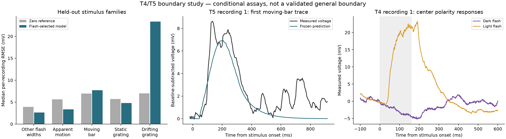

# Drosophila T4/T5 Visual Boundary Identification Study

## Classification

**PARTIAL VISUAL BOUNDARY CONSTRAINT**

Direct T4/T5 measurements now impose useful restrictions on the visual boundary. A conditional T5 flash-to-motion prediction test succeeds for some stimulus families and fails for others. **No general T4/T5 boundary, calibrated FlyWire-root input operator, or necessary explicit precursor circuit has been identified.** No Stage-4/LPLC2 evaluation was performed.

The frozen LPLC2 Diagnostic remains **PARTIAL MECHANISTIC CONSTRAINT — MORE DATA REQUIRED**. This report does not change it or any prior result.

## 1. What was actually obtained

- Pinned original experimental inputs for **17 T5 recording ordinals**, with **3,571 mean response traces / 1,218,609 voltage samples**, from the authors' [2019 repository](https://github.com/reiserlab/T5ConductanceModel/tree/fe52053dda84d49a124e6c1f141dd461eba9630c). Every downloaded Git blob was checked. These are measured inputs to the authors' optimizer, not its simulated outputs.
- The complete **6,320,065,220-byte 2021 Figure-2 archive**, verified against the publisher's MD5 `cabf1b1c6d0ef4af200d41256e2835cf`. Both T4 and T5 members are retained with provenance. The T4 extraction contains **2,260** valid traces from **15 analyzed recording ordinals** plus the explicit author-excluded, MATLAB-empty slot 5. The T5 extraction contains **2,204 traces from 17 recording ordinals**; detailed quantitative polarity summaries are in [POLARITY_ADDENDUM.md](POLARITY_ADDENDUM.md).
- Physical stimulus definitions for flash width/duration/location, minimal/apparent motion, moving bars, static and drifting gratings; raw and source-centered positions remain distinct.
- An anatomical crosswalk audit of **11,822** column-assigned T4/T5 roots, **778** author eye-map matches and their unit viewing vectors. **Eleven subtype disagreements** and **two roots absent from the pinned annotation's T4/T5 subset** remain unresolved.
- Direct sparse-bar calcium data were revisited through Dryad and DANDI. Dryad downloads still returned 403; DANDI exposed a 282-asset raw imaging inventory, not a processed validated T4/T5 response table. This study does not substitute Tm9 or other upstream assays.

Full source/preparation/license details and acquisition limitations are in [SOURCE_DATA_AUDIT.md](SOURCE_DATA_AUDIT.md). Whole-cell mV, calcium and spikes remain separate observation classes. The T5 recordings reused in 2021 do not count as an independent replication of 2019.

## 2. Prospective design and data firewall

PLAN.md preceded response analysis. CONDITIONAL_PROTOCOL.md fixed the candidate families, train/test split, parameter grids, complexity rule and acceptance boundary before fitting. A metadata-only correction in TIMING_AUDIT.md recorded 5 ms flash/moving-bar samples versus 2.5 ms apparent-motion/grating samples before any fit. POLARITY_PROTOCOL.md preceded extraction of the newly acquired polarity responses.

The conditional comparison trained on **width-2 OFF flashes only**, holding out entire flash durations during inner selection. Other flash widths and every motion/grating response were withheld from fitting. All candidate coefficients and the training-only selection were frozen before scoring those families. FIT_ACCESS.json records training-only file reads; process guards and adversarial tests reject prior-study inputs, canonical files, raw arrays and held-out arrays from the fitter. A later guard hardening expanded the denied area from old research directories to the whole non-study workspace; recorded original fitting reads were already restricted to the same training inputs. Fresh-process reproduction under the stronger guard is exact.

**Fly-held-out validation was not possible:** the compact inputs identify recordings, not flies. No cell ordinal was relabeled as a fly. The published RF/PD localization defines a conditional per-recording coordinate frame; it is not an independent anatomy-to-screen transform. Therefore these are **within-recording, stimulus-family-held-out tests**, not population-level validation.

## 3. Candidate comparison

B0 preserves the baseline's strictly rectified two-site delayed correlation. B1s uses seven spatial basis coefficients and one temporal filter. B1t uses two filters and 14 coefficients. B1d adds a phenomenological compression denominator. These are compact voltage approximations, not anatomical precursor populations or identified conductances. Separate ON/OFF parameterization and explicit precursor networks were not automatically instantiated.

The registered complexity rule selected **B1s in 13 recordings, B1t in three and B1d in one**. Selection used the smallest effective parameter count within one duration-fold standard error of the best inner error. This is a documented regularization heuristic; it is not a formal physiological model posterior or an exhaustive minimum-description-length search. Effective fitted degrees of freedom ranged **2.17–7.41**. All candidates and their full training profiles are retained.

### Cross-stimulus test, no refitting

Values are median **per-recording RMSE in mV**, with equal trace weight within each family. The zero column is an explicit baseline-subtracted null reference, not a neural model.

| Held-out family | Recordings | Zero reference | Training-selected model | Best inner-fit B1s | Best inner-fit B1t | Best inner-fit B1d |
|---|---:|---:|---:|---:|---:|---:|
| Other flash widths | 17 | 3.925 | 2.643 | 2.683 | 2.638 | 2.105 |
| Apparent motion | 17 | 5.649 | 3.363 | 3.294 | 3.041 | 2.763 |
| Moving bars | 17 | 6.972 | 7.717 | 7.717 | 8.460 | 6.269 |
| Static gratings | 11 | 5.709 | 4.821 | 5.002 | 5.161 | 3.253 |
| Drifting gratings | 11 | 7.011 | 23.397 | 23.524 | 25.809 | 13.105 |

The candidate-specific columns were each fit/selected using training data only. **They were not re-ranked or adopted using these test errors.** Compression helps some held-out predictions descriptively, but even that candidate fails badly on drifting gratings. The registered flash-selected model performs worse than the zero reference on moving bars and drifting gratings. Apparent-motion improvement alone does not establish a general boundary.

Ranges and every recording/trace result are preserved in RESULTS.json, TEST_TRACE_METRICS.json and PREDICTIVE_RESULTS.csv. No confidence intervals treating time points or unverified recording identities as independent flies are reported. An empirical raw-trial noise ceiling was not available from the compact mean-response inputs.

Examples use recording 1 and its first moving-bar trace, not the best-fitting cell. The polarity panel is a genuine measured mean trace. Prediction curves are labeled model predictions, never simulated LPLC2 activity.

### Important B0 identifiability distinction

Simultaneous static flashes give the two-site correlator zero directional output for **any** observation gain. Its flash-only training design has rank zero in all 17 recordings. The numerical pseudoinverse returned coefficient zero, but the **biological gain is unknown**, not known to be zero. Consequently B0's numerical zero-gain motion scores are not calibrated motion predictions. Its structural inability to account for stationary signed voltage responses is a separate finding. BASELINE_IDENTIFIABILITY.json explicitly preserves that distinction.

## 4. Direct polarity constraint

For T4, at the authors' RF center with width-2, 160 ms flashes, the median response averaged over stimulus plus 75 ms is **−1.416 mV for dark** and **+12.552 mV for light** across 15 analyzed recording ordinals. Corresponding median pre-stimulus RMS values are **0.606** and **0.409 mV**. At 40 ms, the corresponding mean values are **−0.772** and **+4.978 mV**.

These are descriptive signed voltage measurements, not new significance thresholds, inferred inhibitory conductances, calcium signals or a proof that every OFF stimulus activates T4. They constrain the blanket assertion that the nonpreferred-polarity response is identically absent in this assay. The full spatial/width/duration/polarity extraction is retained; the T5 polarity addendum reports the corresponding direct measurements. No polarity values were used to retune the already frozen conditional comparison.

A display pixel is not proven to equal one anatomical column. Thus the recovered single-bar measurements are not advertised as a completed isolated-anatomical-column validation.

## 5. Coordinate identification remains incomplete

Root→column is substantially recorded, but some type annotations conflict. The authors' eye-map data use Mi1 ordinals/CATMAID skeletons and microCT lens indices; these are not FlyWire column IDs. A verified skeleton→root join is missing. The independent anatomical chiasm reflection is documented, but it does not supply each electrophysiology animal's head pose or screen registration. Unknown identity and frame joins are left null.

No reflection/rotation/degree scale was chosen using Stage-4 expansion, receding, approach, grating or LPLC2 values. The physiological gratings analyzed here are original independent whole-cell stimuli. See COORDINATES.md for the chain, uncertainties and unresolved subtype rows.

## 6. Identifiability and biological scope

Selected unregularized design condition numbers were approximately **991–49,497**. Overlapping spatial bases, regularization and temporal-delay tradeoffs make coefficient-level biological interpretations inappropriate. Training-competitive hyperparameter ranges and fold coefficient variability are retained for every recording. They are sensitivity diagnostics, not a unique physiological parameter estimate.

This study did not identify a common T4/T5 time constant, receptor map, voltage-to-calcium transformation, spatial sampling scale or per-root direction field. It did not fit against Stage-4 success metrics or borrow APL/DAN coefficients. T4 polarity descriptions cannot identify T5 parameters; an apparent-motion voltage assay cannot stand in for sparse-bar calcium generalization.

## 7. Is explicit precursor circuitry required?

**Not established.** The tested compact candidates fail important generalization tests. That is evidence against those candidates' broad acceptance, not a proof that every compact boundary fails or that a Mi/Tm/CT1 network is necessary. The independent literature itself includes compact nonlinear explanations of parts of these recordings. No equivalent held-out compact-versus-precursor comparison with matched observation models and causal precursor interventions has been completed here.

No precursor neurons were added to improve fit, no circuit count was chosen, and no large network was built. REPRESENTATION_AND_PRECURSORS.md identifies the evidence needed before making a necessity claim.

## 8. Reproduction, cost and preservation

- Conditional fitting: **1.71 s**, peak process RSS **134.5 MB** on this machine.
- Held-out scoring: **3.80 s**, peak RSS **302.0 MB**; prediction archive **25.55 MB**.
- Fresh-process fitting identical; maximum prediction difference **0.0 mV**, declared tolerance **1e−10 mV**. This is same-environment numerical reproduction, not a cross-platform BLAS guarantee.
- T4 whole-cell extraction: **11.28 s**, peak RSS **173.2 MB** after the member was available. T5 polarity extraction took **9.71 s**, peak RSS **162.2 MB**. These are processing benchmarks, not a continuous neural-runtime benchmark. Acquisition was far slower because of repeated public-download timeouts and connection resets.
- Brain Spec dependency/release validation passed. The **5,678 protected files** were unchanged. Canonical database digest remains `3377c9dddbe2abf89ed9a820a6aabbc1da951cac7bfc1823471c5aac043ea312`: **seven cycles, schedule disabled**.
- Zero new Genesis life cycles, zero Stage-4 reruns, zero LPLC2 runs, no BrainAdapter or canonical-state changes. The **9 implementation tests and 15 study/preservation checks passed**; these are integrity checks, not evidence of biological success. Exact checks and final package hashes accompany the report.

## Review boundary

No deployable visual boundary is frozen: VISUAL_BOUNDARY_SPEC.json deliberately leaves the general model, transfer parameters, root/screen transform and observation mappings null. What is frozen is the **limited conditional analysis and its negative generalization results**.

A future study would need documented fly identities, processed direct calcium/sparse-stimulus data, independent root/eye/screen registration and better-discriminated compact candidates before any downstream evaluation. Those are unresolved requirements, not authorization to run Stage 4, simulate LPLC2 or integrate Genesis. This study stops for review.
